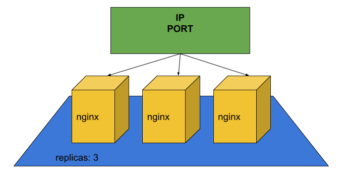

# Perguntas

## Aula 1

1 - O que é verdade sobre um Pod dentro do Kubernetes?
- __Um Pod é a menor unidade de deploy no Kubernetes.__
> Alternativa correta! Um Pod é a menor unidade de deploy!
- __Um Pod tem no mínimo um container associado.__
> Alternativa correta! Um Pod normalmente tem apenas um container associado, mas existe a possibilidade de definir outros containers no mesmo Pod, desde que varia a porta de rede entre os containers isso funciona.
- Quando um Pod morre, ele reinicia sozinho.
- __Um Pod tem um IP.__
> Alternativa correta! Um Pod possui exatamente um IP!

2 - Já conhecemos dois protagonistas desse curso, o minikube e kubectl. Sobre eles, quais afirmações abaixo são verdadeiras?
- kubectl é um orquestrador de container parecido com docker-compose.
- minikube é um container engine e serve principalmente para rodar containers Docker.
- __minikube é uma implementação do Kubernetes.__
> Correto, o minikube é uma implementação de simples uso do Kubernetes. Existem outras como Google GKE, Amazon EKS ou Azure Kubernetes Service.
- __kubectl é a interface de linha de comando para gerenciar Kubernetes.__
> Correto, tanto que já usamos o kubectl para criar um POD!

## Aula 2

1 - Quais das características abaixo aplicam para o recurso Deployment?
- __É responsável por definir a quantidade de replicas do Pod__
> Correto, podemos definir através dashboard, pelo kubectl ou na arquivo yml a quantidade de replicas.
- É responsável por definir a porta de rede do recurso.
- É responsável por distribuir (balancear) a carga.
- __É responsável por garantir que o Pod está disponível (rodando).__
> Correto, um Pod criado SEM deployment não garante disponibilidade.

2 - O que aprendemos sobre serviços nessa aula?
- __Oferecem Load-Balancing__
> Alternativa correta! Por padrão usam Round-robin.
- __Possuem um IP estável__
> Alternativa correta! Correto, isso é a principal tarefa do serviço. Ele possui um IP que não muda e dá acesso a um ou mais Pods.
- Reiniciam Pods que morreram
- Rodam a imagem associada

3 - Recentemente verificamos que o número de usuários do portal de notícias cresceu muito devido a uma ação da equipe de marketing da Alura, e com isso precisamos aumentar a capacidade de processamento do nosso ambiente para atender a essa demanda. Para isso, estamos utilizando o Kubernetes, para orquestrar todos os Pods que criamos em nosso ambiente.
Como um "pod" é a menor unidade dentro de um cluster Kubernetes, o usuário final não tem acesso direto ao conteúdo desse Pod, pois o IP que ele ganha dentro do cluster é um IP interno.
Em nosso ambiente local, utilizando o Minikube, o que é preciso para que um Pod tenha seu conteúdo disponível aos usuários?

- __A__
Podemos colocar um controlador do tipo Deployment para monitorar o estado do nosso Pod, e para garantir o acesso com um IP externo, podemos criar um serviço do tipo LoadBalancer:
``` YML
#service loadBalancer
apiVersion: v1
kind: Service
metadata:
  name: servico-aplicacao-noticia
spec:
  type: LoadBalancer
...

#deployment
apiVersion: apps/v1
kind: Deployment
metadata:
  name: aplicacao-noticia-deployment
spec:
...
```
> Correto! Criando um serviço do tipo LoadBalancer, além de garantir o acesso, o serviço é responsável por dividir a carga nos containers.

- B
Da mesma forma que acessamos um container docker, podemos acessar diretamente um Pod. Essa é a única maneira de acessar o Pod, e podemos obter o endereço ip com o comando describe: ```kubectl describe pods```

- C
Podemos criar apenas um serviço do tipo LoadBalancer, pois ele tem acesso direto ao Pod:
``` YML
#service loadBalance
apiVersion: v1
kind: Service
metadata:
  name: servico-aplicacao-noticia
spec:
  type: LoadBalancer
```

## Aula 3

1 - O seu amigo também está estudando K8s e achou um desenho mais conceitual sobre os objetos no cluster:

O problema é que a legenda do desenho ficou perdida. Você consegue associar corretamente a cor ao tipo do objeto?

- __A__
azul: Deployment
amarelo: Pod
verde: Service
> Alternativa correta! O Pod é a menor unidade de deploy, o deployment é responsável por criar e monitorar os Pods (através de um replicaset) e o service possui um IP/Porta para acessar um dos Pods (balancear a carga).

- B
azul: Pod
amarelo: Service
verde: Deployment

- C
azul: Service
amarelo: Deployment
verde: Pod

2 - Percebemos que ao replicarmos o sistema de notícias, sempre que cadastramos uma nova notícia, as imagens não estavam disponíveis em todos os Pods. Dessa forma geramos um bug para o usuário que queria ver a imagem e não conseguia.
Com qual tipo de controle podemos garantir que o estado de cada Pod seja preservado e compartilhado?

- A

O ideal nesses casos é não replicar a aplicação, pois o Kubernetes não dá suporte a esse problema.

- B

Precisamos montar um volume apenas com o PersistentVolumeClaim, e definir as permissões de acesso ao storage.
``` yml
apiVersion: v1
kind: PersistentVolumeClaim
metadata:
  name: configuracao-permissao
spec:
  accessModes:
    - ReadWriteMany
  resources:
    requests:
      storage: 1Gi
```

- __C__

Podemos colocar um controle do tipo StatefulSet, dessa forma sempre que aplicarmos um Pod, seu estado será preservado.
``` yml
apiVersion: apps/v1beta1
kind: StatefulSet
metadata:
  name: aplicacao-sistema-statefulset
spec:
  serviceName: servico-sistema-statefulset
...
```
> Correto! Com o StatefulSet podemos definir o compartilhamento de arquivos entre os Pods.

## Aula 4

1 - Agora que temos o ambiente que pode se replicar, precisamos avisar nossos gestores toda vez em que um novo Pod é criado em nosso ambiente. Cada novo Pod criado gera um custo financeiro para manter o portal, e os gestores querem acompanhar de perto onde o dinheiro está sendo investido.
Pensando nisso, como podemos avisar os gestores toda vez em que um novo Pod é criado?

- A
Podemos dar um ping em todos os endereços IPs dos Pods, o Pod que não responder é porque está inoperante.
```ping $(kubectl get pods | grep IP)```

- __B__
Utilizando o parâmetro lifecycle na construção das réplicas.
``` yml
lifecycle:
   postStart:
      exec:
         command: ["sh","notificacao.sh"]
```
> Correto! Dessa forma com o parâmetro postStart, após iniciar o Pod, podemos executar a ação de notificação.

- C
O Kubernetes apenas orquestra o ambiente, não possui nenhum tipo de monitoração.

## Aula 5

1 - Historicamente podemos perceber que o portal de notícias da Alura tem um aumento no número de acessos no período da manhã. Porém, sempre que lançamos um produto novo, as campanhas realizadas pela equipe de marketing trazem um número elevado de usuários ao portal.
Pensando nisso, como podemos replicar nosso ambiente de forma automática?

- A
A melhor solução é já definir na criação do ambiente uma quantidade elevada de pods, dessa forma não teremos problema de performance.
``` yml
replicas:
    min: 500
    max: 1000
```

- B
O ideal é contratar um funcionário dedicado para ficar dando ping no ambiente, pois ele saberá o que fazer.

- C
Criando um serviço do tipo "horizontalpodautoscaler"
```kubectl autoscale deployment aplicacao-noticia-deployment --cpu-percent=50 --min=1 --max=10```
> Correto! Dessa forma definimos a quantidade de pods máxima e mínima para suportar nosso ambiente
